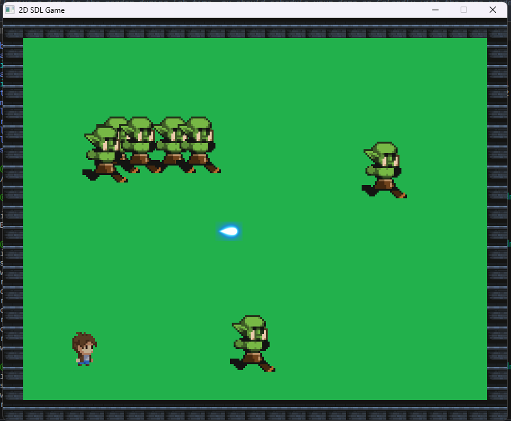

# SDL2 2D Game
 
Authors: [Desmond Chi](https://github.com/desmondcchi), [Luke Zhao](https://github.com/lukezx3), [Fabian Gutierrez](https://github.com/G-Fabian), [Karl Nueckel](https://github.com/KarlNueckel)

## Project Description
### **Importance**
The scope of this project allows for us to practice and improve our C++ knowledge and skills, utilizing APIs, and conforming with software engineering practices that are important in industry, as a team. Working on this project will require an abundance of C++ coding and understanding of the API we choose to utilize. Furthermore, we will utilize Scrum methodologies and Git/GitHub, which are common practices in the software engineering industry. This project is a good opportunity to familiarize with these software engineering practices. 
### **Languages/Tools/Technologies**
We will use C++ as the programming language for this project. Furthermore, we will be using the C++ SDL2 ([Simple DirectMedia Layer 2](https://www.libsdl.org/)) library as an API for "low level access to audio, keyboard, mouse, and 2D framebuffer" to create the 2D game for this project. The SDL2 library will serve as an API for taking user input and processing graphics for our game. We will also be using Visual Studio Code as our IDE and we will be utilizing Git and GitHub profusely throughout project development as a means of version control. 
### **Input/Output**
We will utilize the SDL2 library API to process user input via keyboard and mouse for the game. Through the SDL2 framework, we will create a window application that will display and output the graphics of our 2D game. The SDL2 has implemented functions for processing user input in addition to functionality for easily creating a GUI where the user can view the output of the game (graphics, etc.).
### **Features**
Our game will be a top-down 2D dungeon crawler/bullet hell game. We will utilize sprites, drawn as 2D pixel art, to represent characters, enemies, objects, and also the map structures. The character will have various choices of weapons (mostly ranged), so we will program the physics for moving bullets and detecting bullet collision. Furthermore, we will program the movement of enemies to follow the position of the player in order to have dynamic movement for the enemies to attack the player. The game will progress through completing levels (completing a map by clearing enemies or a boss). The game will also keep track of the player's health and damage they are able to inflict on the enemies based on the weapon they equip. The damage resistance/mitigation of the player will also be accounted for based on the armor that the player equips. Furthermore, there will be enemies of different durabilities, health, damage, and types of attacks. The scale and features of this 2D game will be achievable throughout the period of time we have to develop and create this project.

## Class Diagram

### **`Game` Class**
The `Game` class handles the basic requirements of running the game. It creates the window that the game will be displayed on, renders the player and enemy objects as characters, and takes in keyboard inputs for player movement. To clarify, there is a switch statement which handles the movement based on the given keyboard input (WASD) and stops movement when the key is released. All classes are associated to the `Game` class through composition.

### **`TextureManager`**
The `TextureManager` class provides a helper to load textures. It abstracts the complexity of doing so and makes the code more concise and readible.

### **`Entity` Class**
The `Entity` class is an abstract class which will be inherited by the `Player` class and all the enemy subclasses. The `Entity` class provides the framework for member variables and functions for all objects that represent living entities, such as the player and the enemies. The `Entity` class contains basic member variables that will store health, damage, speed, shield amount, and the x- and y-coordinates of their position. It also declares movement functions so that subclasses that inherit the `Entity` class will be able to move around the map.

### **`Player` Subclass**
The `Player` class represents the player. This class inherits from the `Entity` abstract class and will implement is functions and utilize its variables in addition to some new member variables and functions. The `Player` class will store an integer that represents the experience level of the player and once it hits a certain threshold, the player will level up, increasing their stats. Furthermore, the `Player` class will have functions that implement melee attacks, ranged attacks, healing, shielding, leveling up, and getting the x- and y-coordinates of their position so that the enemies can track and follow the player.

### **`Enemy` Subclass**
The `Enemy` subclass is inherited by `Melee`, `Ranged`, and `Boss` objects because these three subclasses are all classified as enemies that attack the player. The classes that inherit `Enemy` have a function `getPlayerPos()` to track the player and move towards them.
    
### **`Melee` Subclass**
The `Melee` subclass inherits `Enemy` and represents a melee enemy that damages the player when they get near them. The `Melee` subclass contains a `meleeAttack()` which will damage the player and update their health.

### **`Ranged` Subclass**
The `Ranged` subclass inherits `Enemy` and represents a ranged enemy that damages the player by shooting a projectile. The ranged projectile will be shot through the `rangedAttack()` function. 

### **`Boss` Subclass**
The `Boss` subclass defines a stronger enemy that utilizes both melee and range attacks. In some situations, the `Boss` can replenish their health and block the `Player`'s attacks. Each `Boss` will also have a unique special attack that could significantly damage the `Player`.

### **`Projectile` Class**
The `Projectile` class signifies a bullet that will be used to damage the `Player` or `Enemy`'s health depending on who the shooter is. The `Projectile` size, speed, and damage will be specified and its position will be continuously updated as it travels the `LevelMap` via a vector that is created between the shooter and the point being aimed at. If one `Projectile` collides with a wall or dynamic map object, it will disappear.

### **`Vector2D` Class**
The `Vector2D` class represents a vector with a x- and y-component. It can be constructed by passing in two integer x- and y-components or by passing in two Point2D objects. The `Vector2D` class is mainly used to model direction and velocity vectors of movement for entities and projectiles.

### **`Point2D` Class**
The `Point2D` class stores x- and y-coordinates for the main purpose of getting an entity or projectile's position in the window. Furthermore, it is used to store the location at which the mouse was clicked. The `Point2D` class is used in conjunction with `Vector2D` to construct the vectors and create direction/velocity vectors.
 
## Screenshots

This is what is displayed on the screen when the game executable is run. A window pops up, which is the output of the program. The input are the keyboard and mouse. WASD is used to move up, left, down, right and the mouse is used to aim and shoot (with left click).

As all enemies are cleared per round, an incrementing amount of enemies spawn for the next round.

A projectile is shot as the user utilizes mouse input to aim and shoot with left click.

This is the output of the command line as the game is running. There are messages for when the window starts up and ends and also for game events (player dying - game over, and restarting the game).

## Installation/Usage
To install the 2D SDL Game, simply run `git clone --recursive https://github.com/cs100/final-project-dchi008-lzhao065-fguti032-knuec001.git`. The repository contains all the necessary SDL2 library files, which supports Windows (mingw64) and macOS.

To run the game, run `./bin/main.exe` (on Windows) or `./bin/main` (on macOS). If you need to compile the executable, run `make windows_mingw64` (on Windows with mingw64) or `make macos` (on macOS).

## Testing
This project was tested using googletest. The static library files for googletest were compiled to work with mingw64 on Windows and macOS so that the SDL2 library files could be used in conjunction with them.

In addition to googletest, we also used Leaks (a built-in macOS command) to find memory leaks in our game. By using this tool, we were able to detect memory leaks and fix them.

 
